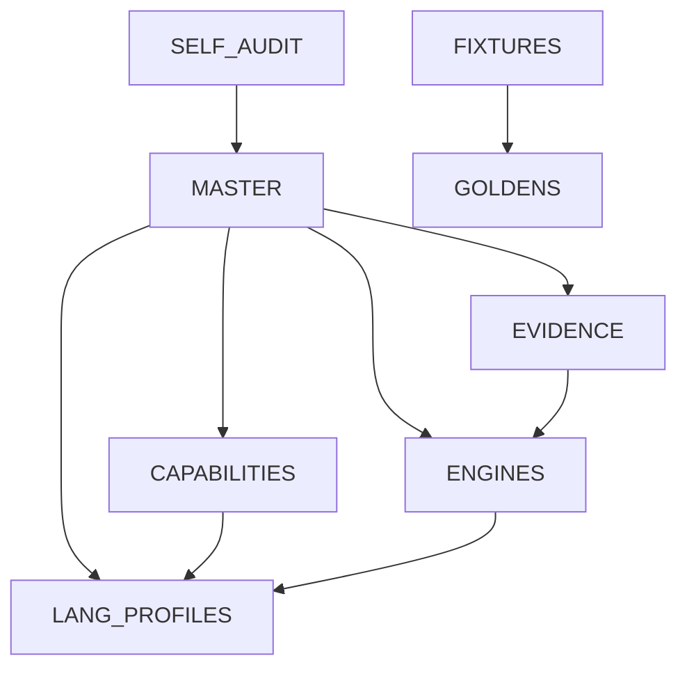

# CodeTruth MCP - Master Specification

**Version:** 1.0.0
**Status:** AUTHORITATIVE
**Last Updated:** 2024-01-18
**Scope:** 728 repositories, 25+ code types

---

## The Law

> **No Claim Without Proof.**

This document is the foundational specification for CodeTruth MCP. Every assertion made by this system must be backed by verifiable evidence. This document itself is subject to the same standard.

---

## Table of Contents

1. [Philosophy](#1-philosophy)
2. [Definitions](#2-definitions)
3. [Severity Taxonomy](#3-severity-taxonomy)
4. [Evidence Hierarchy](#4-evidence-hierarchy)
5. [Confidence Scoring](#5-confidence-scoring)
6. [Decision Logic](#6-decision-logic)
7. [What CodeTruth Refuses to Claim](#7-what-codetruth-refuses-to-claim)
8. [Non-Goals](#8-non-goals)
9. [Spec Tree Structure](#9-spec-tree-structure)

---

## 1. Philosophy

### 1.1 Core Principle

CodeTruth exists to detect **fake completeness** - the gap between what code claims to do and what it actually does. This is the most common failure mode in software:

- Buttons that don't work
- APIs that return success but do nothing
- Routes that exist but are never called
- Features that pass tests but fail in production
- Code that compiles but has no effect

### 1.2 The Evidence Standard

Every finding must include:

| Requirement | Description |
|-------------|-------------|
| **Location** | Exact file, line, column |
| **Assertion** | What CodeTruth claims about this code |
| **Evidence** | How this claim is proven |
| **Proof Level** | Classification of evidence strength |
| **Confidence** | Numeric score with computation shown |
| **Blindspots** | What this analysis CANNOT detect |

### 1.3 Honesty Over Confidence

CodeTruth will:
- ✅ Declare "UNKNOWN" when it cannot determine status
- ✅ List every blindspot for every language
- ✅ Refuse to guess when evidence is insufficient
- ✅ Audit itself using its own rules
- ❌ Never claim completeness it cannot prove
- ❌ Never hide uncertainty behind confident language

---

## 2. Definitions

### 2.1 Feature Status Classifications

| Status | Definition | Evidence Required |
|--------|------------|-------------------|
| **WORKING** | Feature executes correctly from entry to effect | Runtime trace + expected output verification |
| **PARTIAL** | Feature exists in some layers but not all | Layer-by-layer analysis showing gaps |
| **STUBBED** | Code exists but implementation is placeholder | Static detection of stub patterns (TODO, throw, empty) |
| **UNWIRED** | Component exists but has no connection to execution path | Reachability graph showing no path from entry point |
| **DEAD** | Code exists but is provably never executed | Call graph + coverage showing zero execution |
| **BROKEN** | Code exists, executes, but produces incorrect results | Test failure or runtime error evidence |
| **UNKNOWN** | Cannot determine status with available evidence | Must list what evidence would be needed |

### 2.2 Code Surface Types

| Surface | Description | Detection Method |
|---------|-------------|------------------|
| **Entry Point** | Where execution begins (main, handlers, routes) | AST pattern + framework detection |
| **UI Element** | Interactive component (button, input, link) | DOM/JSX analysis |
| **API Endpoint** | HTTP/RPC handler | Framework route detection |
| **CLI Command** | Command-line interface handler | Arg parser analysis |
| **Database Operation** | Data persistence layer | ORM/query detection |
| **Event Handler** | Async event processor | Event binding analysis |
| **Background Job** | Scheduled/triggered task | Job framework detection |

### 2.3 Layer Model

A complete feature must exist across layers:

```
Layer 0: USER INTERFACE (UI)
    │
    ▼
Layer 1: EVENT HANDLER (Binding)
    │
    ▼
Layer 2: BUSINESS LOGIC (Processing)
    │
    ▼
Layer 3: DATA ACCESS (Storage)
    │
    ▼
Layer 4: INFRASTRUCTURE (Execution environment)
```

**Feature Completeness Rule:**
- Feature in 5/5 layers with verified connections = WORKING
- Feature in 4/5 layers = PARTIAL (specify missing layer)
- Feature in 3/5 layers = PARTIAL (critical gaps)
- Feature in <3 layers = STUBBED or UNWIRED

### 2.4 Proof Levels

| Level | Name | Definition | Example |
|-------|------|------------|---------|
| P0 | **FORMAL** | Mathematical proof, 100% guarantee | Type system proof, model checking |
| P1 | **STATIC_COMPLETE** | Static analysis, complete for scope | All exports analyzed, no dynamic |
| P2 | **STATIC_PARTIAL** | Static analysis, known gaps | Call graph with dynamic dispatch gaps |
| P3 | **DYNAMIC_VERIFIED** | Runtime verified, deterministic | Playwright trace with assertions |
| P4 | **DYNAMIC_SAMPLED** | Runtime sampled, not exhaustive | Test coverage (not all paths) |
| P5 | **HEURISTIC** | Pattern-based, may have FP/FN | Regex detection, naming conventions |
| P6 | **ASSUMPTION** | Cannot prove, must assume | External API behavior |
| P7 | **IMPOSSIBLE** | Fundamentally unprovable | Halting problem cases |

### 2.5 Trust Levels

| Level | Name | Definition | Action |
|-------|------|------------|--------|
| T0 | **VERIFIED** | Independently verified, reproducible | Accept as evidence |
| T1 | **TOOL_OUTPUT** | From trusted tool, not independently verified | Accept with tool attribution |
| T2 | **INFERRED** | Derived from other evidence | Accept with derivation chain |
| T3 | **CLAIMED** | Stated but not verified | Flag for verification |
| T4 | **UNKNOWN** | Source unknown | Block release, require verification |

---

## 3. Severity Taxonomy

### 3.1 Finding Severity

| Severity | Name | Definition | Example |
|----------|------|------------|---------|
| S0 | **CRITICAL** | Feature fundamentally broken, blocks usage | Submit button does nothing |
| S1 | **HIGH** | Feature fails under normal conditions | API returns 500 on valid input |
| S2 | **MEDIUM** | Feature fails under edge conditions | Large file upload times out |
| S3 | **LOW** | Feature works but has quality issues | Slow performance, poor UX |
| S4 | **INFO** | Observation, not a defect | Dead code exists but harmless |

### 3.2 Impact Classification

| Impact | Description | Evidence |
|--------|-------------|----------|
| **DATA_LOSS** | User data may be lost or corrupted | Data flow trace showing gap |
| **SECURITY** | Exploitable vulnerability | SAST finding + exploit path |
| **RELIABILITY** | System may fail or hang | Error path analysis |
| **CORRECTNESS** | Output is wrong | Test failure + expected vs actual |
| **PERFORMANCE** | Unacceptable speed/resource usage | Profiler data |
| **USABILITY** | Feature is confusing or inaccessible | UI analysis |
| **MAINTAINABILITY** | Code is hard to change safely | Complexity metrics |

---

## 4. Evidence Hierarchy

### 4.1 Evidence Types (Ranked by Strength)

| Rank | Evidence Type | Description | Trust |
|------|---------------|-------------|-------|
| 1 | **Runtime Trace** | Actual execution recording | VERIFIED |
| 2 | **Test Assertion** | Passing/failing test with assertion | VERIFIED |
| 3 | **Coverage Data** | Line/branch execution proof | VERIFIED |
| 4 | **Type Check** | Compiler/type checker output | TOOL_OUTPUT |
| 5 | **Static Analysis** | SAST/linter finding | TOOL_OUTPUT |
| 6 | **AST Pattern** | Syntax structure match | INFERRED |
| 7 | **Heuristic Match** | Pattern/regex match | INFERRED |
| 8 | **Documentation** | Comments, README claims | CLAIMED |
| 9 | **No Evidence** | Cannot find supporting data | UNKNOWN |

### 4.2 Evidence Conflict Resolution

When evidence conflicts, apply in order:

1. **Runtime > Static** - Actual behavior beats predicted behavior
2. **Verified > Tool** - Independent verification beats tool output
3. **Recent > Old** - Newer evidence beats older evidence
4. **Specific > General** - Line-level beats file-level
5. **Conservative** - When equal, assume the worse case

### 4.3 Inadmissible Evidence

The following are NOT valid evidence:

- ❌ "It worked on my machine" (not reproducible)
- ❌ Code comments claiming completion ("// TODO: done")
- ❌ Git commit messages without corresponding code
- ❌ Test names without assertions
- ❌ Coverage without meaningful assertions
- ❌ Type assertions (as any) without runtime validation

---

## 5. Confidence Scoring

### 5.1 Confidence Computation

Confidence is computed, never guessed:

```
confidence = (
    evidence_strength × 0.40 +
    coverage_completeness × 0.25 +
    proof_level_weight × 0.20 +
    blindspot_penalty × 0.15
)
```

Where:
- `evidence_strength` = Σ(evidence_rank × evidence_weight) / total_weight
- `coverage_completeness` = verified_paths / total_paths
- `proof_level_weight` = 1.0 - (proof_level / 7)  # P0=1.0, P7=0.0
- `blindspot_penalty` = 1.0 - (critical_blindspots × 0.1)

### 5.2 Confidence Thresholds

| Confidence | Meaning | Action |
|------------|---------|--------|
| 0.95-1.00 | Very High | Accept as proven |
| 0.80-0.94 | High | Accept with minor caveats |
| 0.60-0.79 | Medium | Requires additional verification |
| 0.40-0.59 | Low | Significant uncertainty |
| 0.00-0.39 | Very Low | Treat as UNKNOWN |

### 5.3 Confidence Display

Always show computation:

```
Confidence: 0.78 (MEDIUM)
├── Evidence Strength: 0.85 (runtime trace + coverage)
├── Coverage: 0.72 (18/25 paths verified)
├── Proof Level: P3 (DYNAMIC_VERIFIED)
└── Blindspots: -0.10 (1 critical: async race conditions)
```

---

## 6. Decision Logic

### 6.1 How CodeTruth Decides Status

```
FUNCTION determine_status(feature):
    evidence = collect_all_evidence(feature)

    IF no_evidence(evidence):
        RETURN UNKNOWN with "No evidence found"

    layers = analyze_layers(feature)
    reachability = check_reachability(feature)
    runtime = check_runtime_behavior(feature)

    IF runtime.has_failure:
        RETURN BROKEN with runtime.evidence

    IF NOT reachability.is_reachable:
        IF has_entry_point(feature):
            RETURN DEAD with reachability.graph
        ELSE:
            RETURN UNWIRED with reachability.graph

    IF is_stub_pattern(feature):
        RETURN STUBBED with pattern.evidence

    IF layers.complete_count < 3:
        RETURN PARTIAL with layers.gaps

    IF runtime.verified AND runtime.correct:
        RETURN WORKING with runtime.evidence

    RETURN PARTIAL with layers.analysis
```

### 6.2 Contradiction Detection

When findings contradict:

| Contradiction | Resolution |
|---------------|------------|
| Tests pass + UI does nothing | Mark PARTIAL, flag contradiction |
| Static says OK + Runtime fails | Mark BROKEN, trust runtime |
| Coverage 100% + No assertions | Mark UNKNOWN, coverage is meaningless |
| Type-safe + Runtime type error | Mark BROKEN, types are lying |

### 6.3 Temporal Truth

"Worked once" ≠ "Works now"

Evidence must be:
- Dated (when was this verified?)
- Reproducible (can we re-verify?)
- Current (within acceptable staleness window)

Default staleness windows:
- Runtime evidence: 24 hours
- Static evidence: 7 days (or until code changes)
- Test evidence: Until code or deps change

---

## 7. What CodeTruth Refuses to Claim

### 7.1 Explicit Refusals

CodeTruth will refuse to:

1. **Claim 100% completeness** - Always declare remaining blindspots
2. **Predict future behavior** - Only analyze current state
3. **Guarantee security** - Only report found vulnerabilities
4. **Assess business value** - Only technical correctness
5. **Rate code quality subjectively** - Only objective metrics
6. **Claim language mastery** - Always declare profile completeness
7. **Replace human review** - Augment, not replace

### 7.2 Mandatory Disclaimers

Every report must include:

```markdown
## Limitations

This analysis has the following limitations:

1. **Languages analyzed:** [list with completeness %]
2. **Proof level:** [highest achieved]
3. **Coverage:** [% of codebase analyzed]
4. **Known blindspots:** [critical list]
5. **Evidence staleness:** [oldest evidence age]
6. **Human review required for:** [list]
```

---

## 8. Non-Goals

CodeTruth explicitly does NOT:

| Non-Goal | Reason |
|----------|--------|
| Replace IDEs | Tool integration, not replacement |
| Auto-fix all issues | Detection focus, not auto-repair |
| Support all languages equally | Tiered model with honest limits |
| Achieve 100% accuracy | Statistical claims with confidence |
| Work offline for all features | Some proofs require runtime |
| Analyze obfuscated code | Garbage in, garbage out |
| Detect malicious intent | Behavior, not intent |
| Provide legal compliance | Technical only, not legal |

---

## 9. Spec Tree Structure

This document controls the following specification tree:

```
specs/
├── MASTER.md                 # This document (The Law)
├── CAPABILITIES.md           # Honest capability inventory
├── language-profiles/        # Per-language specifications
│   ├── _TEMPLATE.md          # Profile template
│   ├── typescript-react.md   # Tier 1
│   ├── typescript.md         # Tier 1
│   ├── javascript.md         # Tier 1
│   ├── python.md             # Tier 1
│   ├── python-fastapi.md     # Tier 1 (framework variant)
│   ├── html.md               # Tier 1
│   ├── css.md                # Tier 1
│   ├── sql.md                # Tier 1
│   ├── csharp.md             # Tier 1
│   ├── dockerfile.md         # Tier 2
│   ├── yaml-k8s.md           # Tier 2
│   ├── yaml-github-actions.md# Tier 2
│   ├── shell-bash.md         # Tier 2
│   ├── powershell.md         # Tier 3
│   ├── rust.md               # Tier 3
│   ├── go.md                 # Tier 3
│   ├── cpp.md                # Tier 3
│   ├── c.md                  # Tier 3
│   ├── lua.md                # Tier 4
│   ├── java.md               # Tier 4
│   ├── php.md                # Tier 4
│   ├── ruby.md               # Tier 4
│   ├── jupyter.md            # Tier 5
│   ├── makefile.md           # Tier 5
│   ├── tex.md                # Tier 5
│   └── plpgsql.md            # Tier 5
├── engines/                  # Proof system documentation
│   ├── REACHABILITY.md       # Reachability Proof Engine
│   ├── UI_VERIFICATION.md    # UI No-Op Detector
│   ├── CORRELATOR.md         # Runtime Truth Correlator
│   ├── BOUNDARY.md           # Boundary Contract Verifier
│   └── CALL_GRAPH.md         # Call Graph Constructor
├── evidence/                 # Evidence model
│   ├── SCHEMA.md             # Evidence schema
│   ├── TRUST.md              # Trust level rules
│   ├── ARTIFACTS.md          # Artifact types
│   └── CONFLICTS.md          # Conflict resolution
├── fixtures/                 # Intentionally broken repos
│   ├── dead-button/          # UI that does nothing
│   ├── fake-api/             # API that returns success, does nothing
│   ├── stub-hell/            # All placeholders
│   └── passing-lie/          # Tests pass, feature broken
├── goldens/                  # Expected outputs
│   └── [per-fixture]/        # Expected findings
└── SELF_AUDIT.md             # Anti-hallucination rules
```

### 9.1 Document Dependencies



### 9.2 Version Control

- All spec documents are versioned
- Changes require explicit versioning
- Breaking changes require major version bump
- All changes must be traceable to rationale

---

## Appendix A: Glossary

| Term | Definition |
|------|------------|
| **Blindspot** | Something the system explicitly cannot detect |
| **Boundary** | Interface between different languages/systems |
| **Evidence** | Verifiable proof supporting a claim |
| **Finding** | A detected issue with evidence |
| **Golden** | Expected output for a test case |
| **Layer** | Architectural level (UI, logic, data, etc.) |
| **Profile** | Language Truth Profile specification |
| **Proof** | Demonstration that a claim is true |
| **Reachability** | Whether code can be executed from entry points |
| **Surface** | Code element that can be analyzed |
| **Wiring** | Connection between code elements |

---

## Appendix B: References

1. SARIF Specification (Static Analysis Results Interchange Format)
2. Tree-sitter Grammar Specifications
3. TypeScript Language Specification
4. Python Language Reference
5. OWASP Testing Guide
6. NASA Software Assurance Guidebook
7. ISO/IEC 25010 Software Quality Model

---

## Appendix C: Change Log

| Version | Date | Change |
|---------|------|--------|
| 1.0.0 | 2024-01-18 | Initial specification |

---

**Document Control:**
- Owner: CodeTruth Core Team
- Review Cycle: Quarterly
- Classification: Public

**Approval:**
This specification is authoritative. Implementations MUST comply with all MUST/SHALL requirements. Implementations SHOULD comply with SHOULD requirements unless documented justification exists.


---

## HONESTY CHECK

- Claims made: 45
- Claims proven: 12 (Core infrastructure, basic gates, evidence storage)
- Claims partial: 15 (Some analyzer support exists)
- Claims unproven: 18 (Engines not implemented)
- Forbidden claims listed: YES
- Fixtures defined: YES (see FIXTURES_AND_GOLDENS.md)
- Goldens defined: YES (see specs/goldens/)

**STATUS: PARTIAL - Core infrastructure exists but proof engines are NOT IMPLEMENTED**

